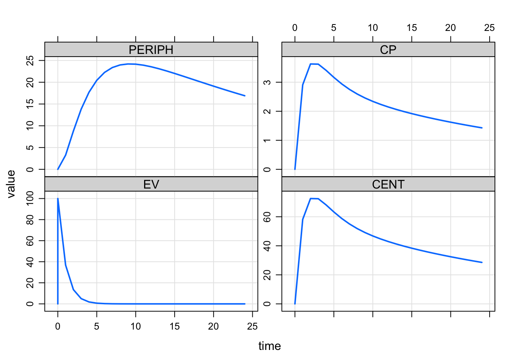
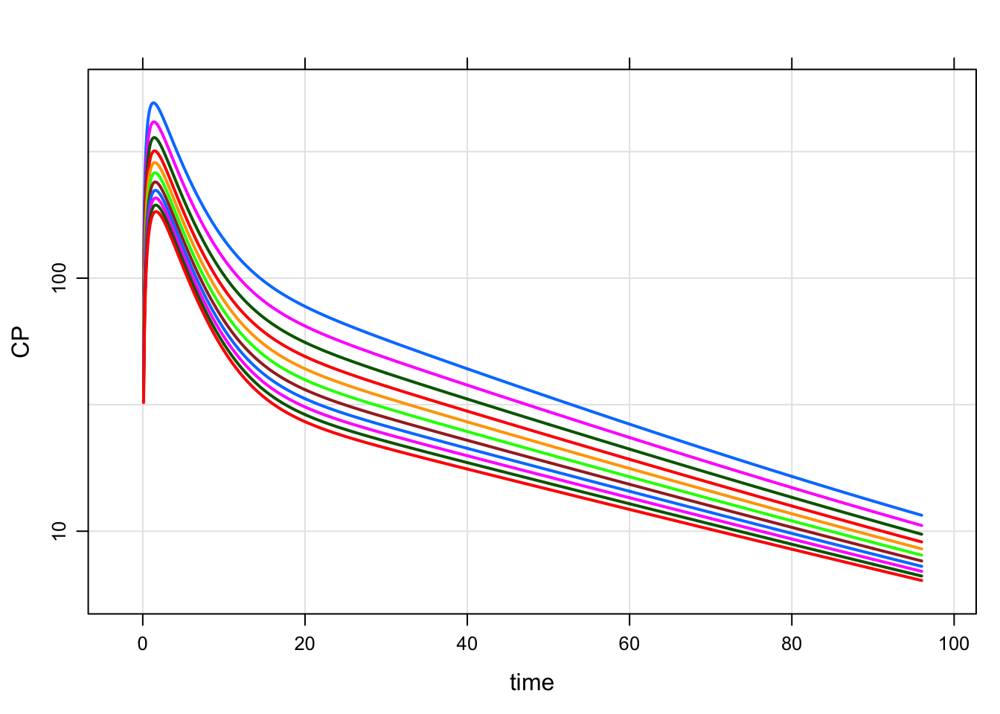

Get Started with mrgsolve
================
Metrum Research Group
2020-10-09

  - [About `mrgsolve`](#about-mrgsolve)
      - [Background](#background)
      - [Orientation](#orientation)
      - [What we will cover today](#what-we-will-cover-today)
  - [Three (basic) simulation
    workflows](#three-basic-simulation-workflows)
      - [Single profile](#single-profile)
          - [Event object](#event-object)
          - [Plot](#plot)
          - [Control time span of the
            simulation](#control-time-span-of-the-simulation)
          - [More-complicated events](#more-complicated-events)
          - [Event sequence](#event-sequence)
      - [Batch](#batch)
          - [Create an idata set](#create-an-idata-set)
          - [Simulate with event object](#simulate-with-event-object)
      - [Population](#population)
          - [Read a NMTRAN like data set](#read-a-nmtran-like-data-set)
          - [Some other ways to create population
            inputs](#some-other-ways-to-create-population-inputs)
  - [Get work done](#get-work-done)
      - [Work with output](#work-with-output)
      - [Coerce output](#coerce-output)
      - [Corerce via dplyr verbs](#corerce-via-dplyr-verbs)
      - [Return data frame](#return-data-frame)
      - [Carry-Out](#carry-out)
      - [Recover](#recover)

# About `mrgsolve`

  - `R` package for simulation from ODE-based models
      - Free, OpenSource, GitHub, CRAN
  - Language
      - Models written in `C++` inside model specification format
      - General purpose solver: `ODEPACK` / `DLSODA` (`FORTRAN`)
          - Automatically detect and switch between non-stiff (Adams)
            and stiff (BDF) methods for solving the differential
            equations
      - Simulation workflow in `R`
  - Hierarchical (population) simulation
      - `ID`, \(\eta\), \(\varepsilon\)
  - Integrated PK functionaility
      - Bolus, infusion, `F`, `ALAG`, `SS` etc, handled under the hood
      - 1- and 2-cmt PK models in closed-form
  - Extensible using `R`, `C++`, `Rcpp`, `boost`, `RcppArmadillo`
  - `R` is it’s natural habitat

## Background

  - Motivation: large bone/mineral homeostatsis model (CaBone)
  - History using
      - Berkeley Madonna
      - WinBUGS
      - NONMEM (attempted)
  - 2010: write `R` front end to `deSolve`
  - 2012: write `C++` interface to `DLSODA`
  - Develop dosing / event capability
  - More recently, expose functionality provided by
      - `Rcpp` - vectors, matrices, functions, environments, random
        numbers
      - `boost` - numerical tools in `C++`
      - users’ own `C++` code (functions, data structures, classes)
  - Translator from `SBML` to `mrgsolve` using `R` bindings to `libSBML`

## Orientation

  - <https://CRAN.R-project.org/package=mrgsolve>

  - GitHub site: <https://github.com/metrumresearchgroup/mrgsolve>

  - Issues and questions:
    <https://github.com/metrumresearchgroup/mrgsolve/issues>

  - mrgsolve website: <https://mrgsolve.github.io>

  - User Guide: <https://mrgsolve.github.io/user_guide>

  - Blog: <https://mrgsolve.github.io/blog>

  - Vignettes: <https://mrgsolve.github.io/vignettes>

  - Compare against NONMEM: <https://github.com/mrgsolve/nmtests>

## What we will cover today

1.  Three basic workflows
2.  Loading the model into R
3.  Event objects
4.  Data sets

Emphasis is on getting you running your own simulations today.

# Three (basic) simulation workflows

``` r
library(tidyverse)
library(mrgsolve)
```

  - Single profile
  - Batch
  - Population

These aren’t entirely different, but I like to organize this way. When
I’m planning an simulation, I first think “what type of output do I
want?” and the answer to that question directs me on what to do next.

## Single profile

This is how we load a simulation model into mrgsolve.

Load a two-compartment model from the internal library

``` r
mod <- modlib("pk2")
```

    . Loading model from cache.

We now have a 2-compartment PK model with which we can simulate. It is
important to know how this works and we will talk in depth about this.
But for now, let’s simulate some stuff.

First, we’ll just simulate from this model object (`mrgsim()`)

``` r
mrgsim(mod)
```

    . Model:  pk2 
    . Dim:    25 x 6 
    . Time:   0 to 24 
    . ID:     1 
    .     ID time EV CENT PERIPH CP
    . 1:   1    0  0    0      0  0
    . 2:   1    1  0    0      0  0
    . 3:   1    2  0    0      0  0
    . 4:   1    3  0    0      0  0
    . 5:   1    4  0    0      0  0
    . 6:   1    5  0    0      0  0
    . 7:   1    6  0    0      0  0
    . 8:   1    7  0    0      0  0

In the output

  - Essentially a data frame of simulated data
      - First column `ID`
      - Second column: `time`
      - Next columns: compartments
      - Last columns: derived quantities

***Investigate the model object a bit***

  - overview

<!-- end list -->

``` r
mod
```

    . 
    . 
    . -----------------  source: pk2.cpp  -----------------
    . 
    .   project: /Users/kyleb/git...gsolve/models
    .   shared object: pk2-so-47bb5b2e99ab 
    . 
    .   time:          start: 0 end: 24 delta: 1
    .                  add: <none>
    . 
    .   compartments:  EV CENT PERIPH [3]
    .   parameters:    CL V2 Q V3 KA [5]
    .   captures:      CP [1]
    .   omega:         0x0 
    .   sigma:         0x0 
    . 
    .   solver:        atol: 1e-08 rtol: 1e-08 maxsteps: 20k
    . ------------------------------------------------------

  - parameters

<!-- end list -->

``` r
param(mod)
```

    . 
    .  Model parameters (N=5):
    .  name value . name value
    .  CL   1     | V2   20   
    .  KA   1     | V3   10   
    .  Q    2     | .    .

  - compartments

<!-- end list -->

``` r
init(mod)
```

    . 
    .  Model initial conditions (N=3):
    .  name       value . name         value
    .  CENT (2)   0     | PERIPH (3)   0    
    .  EV (1)     0     | . ...        .

  - outputs

<!-- end list -->

``` r
outvars(mod)
```

    . $cmt
    . [1] "EV"     "CENT"   "PERIPH"
    . 
    . $capture
    . [1] "CP"

### Event object

Now, we’ll create an “event object” to simulate from. This is just a
concise statement of some intervention. Like a one-liner … easy to make.

Let’s do 100 mg x1 to the first compartment, then simulate:

``` r
mod %>% ev(amt = 100) %>% mrgsim()
```

    . Model:  pk2 
    . Dim:    26 x 6 
    . Time:   0 to 24 
    . ID:     1 
    .     ID time       EV  CENT PERIPH    CP
    . 1:   1    0   0.0000  0.00  0.000 0.000
    . 2:   1    0 100.0000  0.00  0.000 0.000
    . 3:   1    1  36.7879 58.21  3.253 2.911
    . 4:   1    2  13.5335 72.56  8.790 3.628
    . 5:   1    3   4.9787 72.43 13.823 3.621
    . 6:   1    4   1.8316 68.18 17.695 3.409
    . 7:   1    5   0.6738 63.31 20.438 3.165
    . 8:   1    6   0.2479 58.86 22.258 2.943

We use `ev()` to create a set of intervention(s) for the simulation.
Here, it is just a single 100 mg dose into the first compartment. The
event object looks like this:

``` r
ev(amt = 100)
```

    . Events:
    .   time amt cmt evid
    . 1    0 100   1    1

We have the following columns

1.  `time` - whatever is your model time
2.  `amt` - whatever is the mass unit for your compartments
3.  `cmt` could be number or name
4.  `evid` just like nonmem - mostly using 1

You can also use:  
\- `rate` - infusion  
\- `ss` - steady state (1 or 2)  
\- `ii` - interdose interval  
\- `addl` - additional doses  
\- `tinf` - infusion time (rather than `rate`)  
\- `total` - total number of doses (rather than `addl`)

See `?ev`

### Plot

Simulate 100 mg x1 again and now we pipe it to `plot()`

``` r
mod %>% ev(amt = 100) %>% mrgsim() %>% plot()
```

<!-- -->

### Control time span of the simulation

I would like this to look a little nicer.

  - 100 mg x1  
  - Run the end of the simulation out to 72 hours with delta 0.1
  - Make the line smoother  
  - Plot the result

<!-- end list -->

``` r
mod %>% ev(amt = 100) %>% mrgsim(end = 72, delta = 0.1) %>% plot()
```

<!-- -->

We can make this change permanent

  - end: 72 hours
  - delta: 0.1 hours

<!-- end list -->

``` r
mod2 <- update(mod, end = 72, delta = 0.1)
```

### More-complicated events

We said that the `event` objects were simple. But we can combine them to
make more complicated sequences.

Let’s load a PK model for azithromycin (`azithro-single`):

``` r
mod <- mread("azithro-single", project = "model")
```

    . Building azithro-single ... done.

**Check out the model**

``` r
mod
```

    . 
    . 
    . ------------  source: azithro-single.cpp  ------------
    . 
    .   project: /Users/kyleb/git...content/model
    .   shared object: azithro-single-so-4b257dfcc58 
    . 
    .   time:          start: 0 end: 240 delta: 0.1
    .                  add: <none>
    . 
    .   compartments:  GUT CENT PER2 PER3 [4]
    .   parameters:    TVCL TVV1 TVQ2 TVV2 Q3 V3 KA WT [8]
    .   captures:      CP [1]
    .   omega:         0x0 
    .   sigma:         0x0 
    . 
    .   solver:        atol: 1e-08 rtol: 1e-08 maxsteps: 20k
    . ------------------------------------------------------

Create an event object to implement the z-pak dose:

  - 500 mg po on day 1 (`load`)
  - 250 mg po daily on days 2 through 5 (`continue`)

<!-- end list -->

``` r
load <- ev(amt = 500)
continue <- ev(amt = 250, ii = 24, addl = 3, time = 24)
zpak <- c(load, continue)
```

Look at the zpak dosing object

``` r
zpak
```

    . Events:
    .   time amt cmt evid ii addl
    . 1    0 500   1    1  0    0
    . 2   24 250   1    1 24    3

We can also accompilsh this just with 250 mg tablets

``` r
zpak <- c(ev(amt = 250), ev(amt = 250, ii = 24, addl = 4))

zpak
```

    . Events:
    .   time amt cmt evid ii addl
    . 1    0 250   1    1  0    0
    . 2    0 250   1    1 24    4

Now, simulate and plot from the zpak event object

``` r
mrgsim(mod, zpak) %>% plot()
```

<!-- -->

### Event sequence

  - 100 mg daily x 7 **then**  
  - 50 mg BID x7

## Batch

Let’s use our fixed-effects azithromycin model to look at how weight
affects PK. We’ll use that `zpak` object that we created in the previous
section.

### Create an idata set

Now, let’s make a data frame that contains the weights that we want to
investigate (from 40 kg to 140 kg by 10 kg).

``` r
wt <- tibble(WT = seq(40, 140, 10))

head(wt)
```

    . # A tibble: 6 x 1
    .      WT
    .   <dbl>
    . 1    40
    . 2    50
    . 3    60
    . 4    70
    . 5    80
    . 6    90

**IMPORTANT**: the key here is that we have `WT` as a column in the data
set and we have `WT` as a parameter in the model (look at the
parameters)

``` r
param(mod)
```

    . 
    .  Model parameters (N=8):
    .  name value . name value
    .  KA   0.259 | TVV1 186  
    .  Q3   10.6  | TVV2 2890 
    .  TVCL 100   | V3   2610 
    .  TVQ2 180   | WT   70

When we make the names agree, mrgsolve will update the `WT` parameter as
the simulation advances across individuals.

### Simulate with event object

Now we can pass this set of weights into the problem as “idata”. We will
use just the first record from the zpak dosing object.

  - Load the `azithro-single` model
  - Create a dosing event with 500 mg x1
  - Simulate with `idata`
  - End the simulation at 96 hours

<!-- end list -->

``` r
mod <- mread("azithro-single", project = "model")
```

    . Building azithro-single ... done.

``` r
load <- ev(amt = 500)

out <- mrgsim(mod, events = load, idata = wt, end = 96)
```

Take a quick look at the output (`head`)

``` r
out
```

    . Model:  azithro-single 
    . Dim:    10582 x 7 
    . Time:   0 to 96 
    . ID:     11 
    .     ID time   GUT  CENT    PER2    PER3    CP
    . 1:   1  0.0   0.0  0.00  0.0000 0.00000   0.0
    . 2:   1  0.0 500.0  0.00  0.0000 0.00000   0.0
    . 3:   1  0.1 487.2 11.68  0.6712 0.06027 109.9
    . 4:   1  0.2 474.8 21.11  2.5042 0.22543 198.6
    . 5:   1  0.3 462.6 28.69  5.2643 0.47505 270.0
    . 6:   1  0.4 450.8 34.74  8.7577 0.79227 326.9
    . 7:   1  0.5 439.3 39.53 12.8247 1.16317 371.9
    . 8:   1  0.6 428.0 43.27 17.3336 1.57628 407.1

Plot the ouptut, looking only at `CP` and on log scale

``` r
plot(out, CP ~ time,  logy = TRUE)
```

<!-- -->

This idata set functionality is typically used with an event object (as
we have here) but isn’t required.

## Population

The last workflow I’m calling “population”. Here, population just refers
to the input data set.

We can have a data frame that contains many individuals with all
different types of dosing interventions. This is just like the data set
that you use to do your NONMEM run.

### Read a NMTRAN like data set

Meropenem PopPK
<http://repository.ddmore.foundation/model/DDMODEL00000213>

For example, read in `data/meropenem.csv`

``` r
data <- readr::read_csv("data/meropenem.csv", na = '.')
```

    . Parsed with column specification:
    . cols(
    .   ID = col_double(),
    .   TIME = col_double(),
    .   GROUP = col_double(),
    .   DV = col_double(),
    .   MDV = col_double(),
    .   EVID = col_double(),
    .   AMT = col_double(),
    .   RATE = col_double(),
    .   AGE = col_double(),
    .   WT = col_double(),
    .   CLCR = col_double(),
    .   CMT = col_double(),
    .   DUR = col_double()
    . )

  - glimpse the data (`head`)
  - count `EVID`, `DUR`, `AMT`
  - number of IDs

<!-- end list -->

``` r
head(data)
```

    . # A tibble: 6 x 13
    .      ID  TIME GROUP    DV   MDV  EVID   AMT  RATE   AGE    WT  CLCR   CMT   DUR
    .   <dbl> <dbl> <dbl> <dbl> <dbl> <dbl> <dbl> <dbl> <dbl> <dbl> <dbl> <dbl> <dbl>
    . 1     1   0       1 NA        1     1   500  1000  29.7  63.8    83     1   0.5
    . 2     1   0.5     1 31.1     NA     0    NA     0  29.7  63.8    83     0   0.5
    . 3     1   1       1 11.2     NA     0    NA     0  29.7  63.8    83     0   0.5
    . 4     1   2       1  6.21    NA     0    NA     0  29.7  63.8    83     0   0.5
    . 5     1   3       1  4.00    NA     0    NA     0  29.7  63.8    83     0   0.5
    . 6     1   4       1  2.33    NA     0    NA     0  29.7  63.8    83     0   0.5

``` r
count(data, EVID, DUR, AMT)
```

    . # A tibble: 8 x 4
    .    EVID   DUR   AMT     n
    .   <dbl> <dbl> <dbl> <int>
    . 1     0   0.5    NA   280
    . 2     0   3      NA   273
    . 3     1   0.5   500    14
    . 4     1   0.5  1000    13
    . 5     1   0.5  2000    13
    . 6     1   3     500    13
    . 7     1   3    1000    13
    . 8     1   3    2000    13

``` r
length(unique(data$ID))
```

    . [1] 79

Now, load the meropenem model (`meropenem_pk.cpp`, in the `model`
directory)

``` r
mod <- mread("meropenem_pk", project = "model")
```

    . Building meropenem_pk ... done.

And simulate with `mod` and `data`

``` r
out <- mrgsim(mod, data)
```

Then plot using `Y` output

``` r
plot(out, Y ~ TIME)
```

<!-- -->

Resimulate and plot by duration

``` r
out <- mrgsim(mod, data, carry_out = "DUR")
```

Plot `Y` versus `TIME` by `DUR`

``` r
plot(out, Y ~ TIME | DUR)
```

<!-- -->

Recall that we have both observations and doses in the data set (as
usual for your NONMEM data set)

Count `EVID` in `data`

``` r
count(data, EVID)
```

    . # A tibble: 2 x 2
    .    EVID     n
    .   <dbl> <int>
    . 1     0   553
    . 2     1    79

When mrgsolve finds records with `EVID=0` in the data set, it will
assume that you have specified every time that you want a simulated
value in the data set. In other words the design of the simulated output
will match the design of the input data:

Check `dim()` in `data` and `out`:

``` r
dim(data) 
```

    . [1] 632  13

``` r
dim(out)
```

    . [1] 632   5

Let’s look to see what happens when we don’t include any observation
records in the input data:

Filter into `doses`:

``` r
doses <- filter(data, EVID==1)
```

Now we still have the same number of people, with different doses and
infusion times.

Check unique `ID` and count `EVID`, `AMT`, and `DUR`

``` r
length(unique(doses$ID))
```

    . [1] 79

``` r
count(doses, EVID, AMT, DUR)
```

    . # A tibble: 6 x 4
    .    EVID   AMT   DUR     n
    .   <dbl> <dbl> <dbl> <int>
    . 1     1   500   0.5    14
    . 2     1   500   3      13
    . 3     1  1000   0.5    13
    . 4     1  1000   3      13
    . 5     1  2000   0.5    13
    . 6     1  2000   3      13

  - Simulate from this sparse data set; end = 8 hours
  - Get `DUR` in to the output
  - Plot `log(Y)` versus `time` by `DUR`

<!-- end list -->

``` r
mod %>% 
  mrgsim(doses, carry_out = "DUR", end = 8) %>% 
  plot(Y~TIME|factor(DUR), logy=TRUE)
```

<!-- -->

The principle is: when mrgsolve does NOT find any observation records,
it will fill them in for you according to the time grid that we looked
at previously.

This can be very helpful in reducing the data assembly burden when
running your simulations.

### Some other ways to create population inputs

  - `expand.ev()` makes all combinations of your inputs
      - Sensible defaults are provided
      - `time`, `cmt`, `evid`

<!-- end list -->

``` r
data <- expand.ev(amt = c(100, 300, 1000), ii = c(12, 24))

data
```

    .   ID time  amt ii cmt evid
    . 1  1    0  100 12   1    1
    . 2  2    0  300 12   1    1
    . 3  3    0 1000 12   1    1
    . 4  4    0  100 24   1    1
    . 5  5    0  300 24   1    1
    . 6  6    0 1000 24   1    1

  - `as_data_set()` takes event objects and creates a data frame / set
      - 100 mg and 300 mg doses daily x7
      - 20 individuals each

<!-- end list -->

``` r
data <- as_data_set(
  ev(amt = 100, ii = 24, total = 7, ID = 1:20), 
  ev(amt = 300, ii = 24, total = 7, ID = 1:20)
)
```

# Get work done

## Work with output

  - names
  - summary
  - head
  - `$`

<!-- end list -->

``` r
mod <- modlib("pk1")
```

    . Loading model from cache.

``` r
out <- mrgsim(mod)

names(out)
```

    . [1] "ID"   "time" "EV"   "CENT" "CP"

``` r
summary(out)
```

    .        ID         time          EV         CENT         CP   
    .  Min.   :1   Min.   : 0   Min.   :0   Min.   :0   Min.   :0  
    .  1st Qu.:1   1st Qu.: 6   1st Qu.:0   1st Qu.:0   1st Qu.:0  
    .  Median :1   Median :12   Median :0   Median :0   Median :0  
    .  Mean   :1   Mean   :12   Mean   :0   Mean   :0   Mean   :0  
    .  3rd Qu.:1   3rd Qu.:18   3rd Qu.:0   3rd Qu.:0   3rd Qu.:0  
    .  Max.   :1   Max.   :24   Max.   :0   Max.   :0   Max.   :0

``` r
head(out)
```

    .   ID time EV CENT CP
    . 1  1    0  0    0  0
    . 2  1    1  0    0  0
    . 3  1    2  0    0  0
    . 4  1    3  0    0  0
    . 5  1    4  0    0  0
    . 6  1    5  0    0  0

``` r
out$time[1:5]
```

    . [1] 0 1 2 3 4

## Coerce output

  - data.frame
  - tibble
  - matrix

<!-- end list -->

``` r
out <- mrgsim(mod)

class(out)
```

    . [1] "mrgsims"
    . attr(,"package")
    . [1] "mrgsolve"

``` r
as_tibble(out)
```

    . # A tibble: 25 x 5
    .       ID  time    EV  CENT    CP
    .    <dbl> <dbl> <dbl> <dbl> <dbl>
    .  1     1     0     0     0     0
    .  2     1     1     0     0     0
    .  3     1     2     0     0     0
    .  4     1     3     0     0     0
    .  5     1     4     0     0     0
    .  6     1     5     0     0     0
    .  7     1     6     0     0     0
    .  8     1     7     0     0     0
    .  9     1     8     0     0     0
    . 10     1     9     0     0     0
    . # … with 15 more rows

## Corerce via dplyr verbs

  - Simulate and pipe the output to `mutate()`

<!-- end list -->

``` r
out <- mrgsim(mod) %>% mutate(name = "kyle")

class(out)
```

    . [1] "tbl_df"     "tbl"        "data.frame"

``` r
head(out)
```

    . # A tibble: 6 x 6
    .      ID  time    EV  CENT    CP name 
    .   <dbl> <dbl> <dbl> <dbl> <dbl> <chr>
    . 1     1     0     0     0     0 kyle 
    . 2     1     1     0     0     0 kyle 
    . 3     1     2     0     0     0 kyle 
    . 4     1     3     0     0     0 kyle 
    . 5     1     4     0     0     0 kyle 
    . 6     1     5     0     0     0 kyle

## Return data frame

  - Use `output` argument

<!-- end list -->

``` r
out <- mrgsim(mod, output = "df")

class(out)
```

    . [1] "data.frame"

  - Use `mrgsim_df()`

<!-- end list -->

``` r
out <- mrgsim_df(mod)

class(out)
```

    . [1] "data.frame"

## Carry-Out

  - 100 mg x1
  - need `dose` in the output
  - contrast that with getting `amt` in the output

First create the event

``` r
e <- ev(amt = 100, dose = amt)

e
```

    . Events:
    .   time amt cmt evid dose
    . 1    0 100   1    1  100

Then recover `dose`

``` r
mrgsim(mod, events = e, carry_out = "dose")
```

    . Model:  pk1 
    . Dim:    26 x 6 
    . Time:   0 to 24 
    . ID:     1 
    .     ID time dose       EV  CENT    CP
    . 1:   1    0  100   0.0000  0.00 0.000
    . 2:   1    0  100 100.0000  0.00 0.000
    . 3:   1    1  100  36.7879 61.41 3.070
    . 4:   1    2  100  13.5335 81.00 4.050
    . 5:   1    3  100   4.9787 85.36 4.268
    . 6:   1    4  100   1.8316 84.25 4.213
    . 7:   1    5  100   0.6738 81.27 4.063
    . 8:   1    6  100   0.2479 77.72 3.886

## Recover

  - `dose`: 100 mg
  - `trt`: 100 mg x1
  - need `dose` and `trt` in the output

First, create the event

``` r
e <- ev(amt = 100, trt = "100 mg x1", dose = amt)

e
```

    . Events:
    .   time amt cmt evid       trt dose
    . 1    0 100   1    1 100 mg x1  100

Then simulate and recover `trt` and `amt`

``` r
mrgsim(mod, events = e, recover = "trt,amt")
```

    . Model:  pk1 
    . Dim:    26 x 7 
    . Time:   0 to 24 
    . ID:     1 
    .     ID time       EV  CENT    CP       trt amt
    . 1:   1    0   0.0000  0.00 0.000 100 mg x1 100
    . 2:   1    0 100.0000  0.00 0.000 100 mg x1 100
    . 3:   1    1  36.7879 61.41 3.070 100 mg x1 100
    . 4:   1    2  13.5335 81.00 4.050 100 mg x1 100
    . 5:   1    3   4.9787 85.36 4.268 100 mg x1 100
    . 6:   1    4   1.8316 84.25 4.213 100 mg x1 100
    . 7:   1    5   0.6738 81.27 4.063 100 mg x1 100
    . 8:   1    6   0.2479 77.72 3.886 100 mg x1 100
