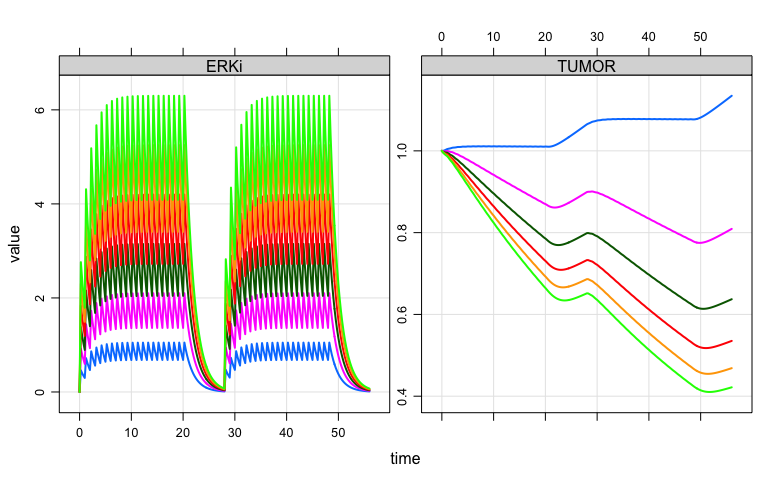
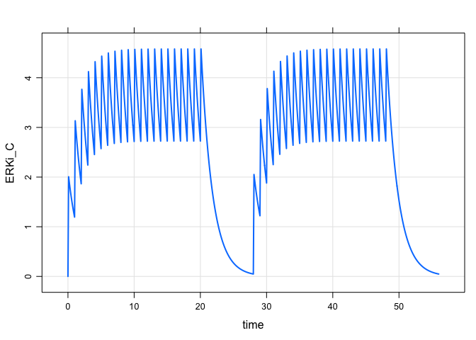
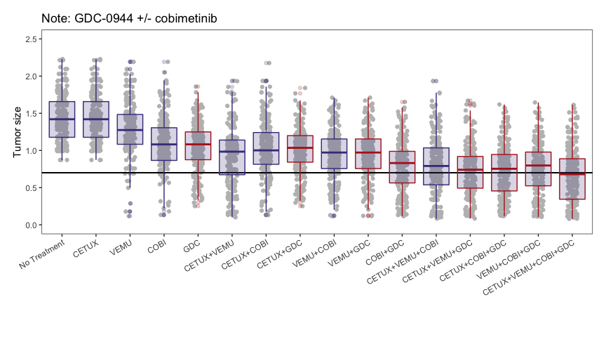

Clinical responses to ERK inhibition in BRAF{V600E}-mutant colorectal
cancer
================
Metrum Research Group

  - [Reference](#reference)
      - [Introduction](#introduction)
      - [Cast of characters](#cast-of-characters)
  - [Translation](#translation)
  - [Set up](#set-up)
  - [Explore](#explore)
      - [Simulate with ERK inhibitor
        GDC-0944](#simulate-with-erk-inhibitor-gdc-0944)
      - [Sensitivity analysis](#sensitivity-analysis)
  - [Predicting clinical outcomes for combination
    therapies](#predicting-clinical-outcomes-for-combination-therapies)
      - [Generate dosing regimens](#generate-dosing-regimens)
      - [Simulate all combination
        therapies](#simulate-all-combination-therapies)
      - [Summarize and plot](#summarize-and-plot)

# Reference

**Clinical responses to ERK inhibition in BRAF{V600E}-mutant colorectal
cancer predicted using a computational model**

  - Daniel C. Kirouac, Gabriele Schaefer, Jocelyn Chan, Mark Merchant,
    Christine Orr, Shih-Min A. Huang, John Moffat, Lichuan Liu, Kapil
    Gadkar and Saroja Ramanujan

  - npj Systems Biology and Applications (2017) 3:14 ; <doi:10.1038> /
    s41540-017-0016-1

## Introduction

(Summarized from Introduction in the reference)

  - The V600E/K mutation results in constitutively active BRAF, with
    subsequent signalling through MEK and ERK

  - BRAF and MEK inhibitors were found to be effective in V600E mutant
    melanoma, but not so much in colorectal cancer
    
      - Could resistance to BRAF inhibitors be mediated through EGFR
        signalling through RAS and CRAF?
      - What about inhibition at ERK?
      - Could the effectiveness of different combination therapies be
        predicted with a model characterizing this biology?

## Cast of characters

  - **vemurafenib**: BRAF inhibitor (selective for V600E mutant)
  - **cobimetinib**: MEK inhibitor
  - **cetuximab**: EGFR antibody
  - **GDC-0994**: ERK inhibitor (the star)

# Translation

  - Model published as SBML
  - Translator from previous project work using R bindings to libSBML
  - Minor modifications to the translator code to accommodate the MAPK
    model as published

# Set up

``` r
library(mrgsolve)
library(tidyverse)
library(parallel)
source("functions.R")
# mclapply <- lapply
```

Read in the virtual population

``` r
vp <- readRDS("s10vpop_pk.RDS") %>% mutate(VPOP2 = seq(n()))

dim(vp)
```

    . [1] 250 147

Load the model and pick one parameter set from vpop

``` r
mod <- mread("mapk") %>% update(end  = 56)

mod <- param(mod, filter(vp,VPOP2==41))
```

# Explore

## Simulate with ERK inhibitor GDC-0944

``` r
e <- expand.ev(amt = seq(100,600,100), cmt = 12, ii = 1, addl = 20)

e <- ev_seq(e, wait = 7, e) %>% as_tibble() %>% arrange(ID)

mod %>% 
  data_set(e) %>%
  Req(TUMOR,ERKi) %>%
  mrgsim(delta = 0.25) %>% 
  plot(ERKi+TUMOR ~ time)
```

<!-- -->

## Sensitivity analysis

The authors note two parameters that are particularly influential with
respect to response rates:

  - wOR: MAPK pathway dependence parameter
  - \(\delta_{max}\): the maximum cell death rate

<!-- end list -->

``` r
vp %>% select(wOR,dmax) %>%
  map(quantile, probs = seq(0,1,0.1)) %>% 
  bind_cols() %>% mutate(pctile = seq(0,1,0.1))
```

    . # A tibble: 11 x 3
    .      wOR   dmax pctile
    .    <dbl>  <dbl>  <dbl>
    .  1 0.754 0.0331    0  
    .  2 0.828 0.0369    0.1
    .  3 0.860 0.0380    0.2
    .  4 0.873 0.0400    0.3
    .  5 0.890 0.0416    0.4
    .  6 0.906 0.0426    0.5
    .  7 0.918 0.0440    0.6
    .  8 0.951 0.0449    0.7
    .  9 0.977 0.0464    0.8
    . 10 1     0.0485    0.9
    . 11 1     0.0522    1

# Predicting clinical outcomes for combination therapies

  - Re-create figure 6B in the publication

## Generate dosing regimens

  - **No treatment**

<!-- end list -->

``` r
data0 <- ev(amt=0, cmt=8)
```

  - **BRAF inhibitor** - vemurafanib (VEMU)
  - Compartment 8

<!-- end list -->

``` r
dataV <- ev(amt=960,  cmt=8, ii=0.5, addl=120)
```

  - **ERK inhibitor** - GCD-994 (GDC)
  - Compartment 12

<!-- end list -->

``` r
dataG <- ev(amt = 400, cmt = 12, ii = 1, addl = 20)

dataG <- seq(dataG, wait = 7, dataG) 

out <- mrgsim(mod, ev=dataG, end=56, delta  = 0.1)

plot(out, ERKi_C~time)
```

<!-- -->

  - **MEK inhibitor** - cobimetinib (COBI)
  - Compartment 10

<!-- end list -->

``` r
dataCO <- mutate(dataG,amt=60,cmt=10)
```

  - **EGFR inihbitor** - cetuximab (CETUX)
  - Compartment 7

<!-- end list -->

``` r
dataCE <- ev(cmt=7,ii=7,addl=7,amt=450)
```

We create two functions: one to combine dosing regimens and the other to
simulate from a dosing regimen

``` r
comb <- function(...) {
  x <- lapply(list(...), as.data.frame)
  bind_rows(x) %>% arrange(time)
}

sim <- function(Data,Vp,Mod) {
  Mod %>%
    ev(as.ev(Data)) %>%
    mrgsim(idata=Vp,end=-1, add = 56) %>%
    filter(time==56) 
}
```

For example

``` r
comb(dataCE,dataV)
```

    .   time cmt amt evid  ii addl
    . 1    0   7 450    1 7.0    7
    . 2    0   8 960    1 0.5  120

``` r
sim(comb(dataCE,dataV), Vp = slice(vp,seq(10)), Mod = mod)
```

    . # A tibble: 10 x 25
    .       ID  time   TD1 CELLS     FB1     FB2     FB3   FB4 RTK1i_blood
    .    <dbl> <dbl> <dbl> <dbl>   <dbl>   <dbl>   <dbl> <dbl>       <dbl>
    .  1     1    56 0.996 0.871 6.95e-1 6.95e-1 6.95e-1 0.437        246.
    .  2     2    56 0.401 0.963 1.44e-4 1.44e-4 1.44e-4 0.547        246.
    .  3     3    56 0.363 1.18  1.15e-4 1.15e-4 1.15e-4 0.703        246.
    .  4     4    56 0.186 0.726 1.52e-4 1.52e-4 1.51e-4 0.649        246.
    .  5     5    56 0.348 0.903 2.21e-2 2.20e-2 2.20e-2 0.662        246.
    .  6     6    56 0.999 1.06  9.39e-1 9.39e-1 9.39e-1 0.731        246.
    .  7     7    56 0.999 1.42  9.02e-1 9.02e-1 9.02e-1 0.731        246.
    .  8     8    56 0.636 1.02  2.39e-4 2.30e-4 2.27e-4 0.630        246.
    .  9     9    56 0.952 1.16  1.95e-1 1.95e-1 1.95e-1 0.688        246.
    . 10    10    56 0.964 1.02  2.52e-1 2.52e-1 2.52e-1 0.649        246.
    . # … with 16 more variables: RAFi_gut <dbl>, RAFi_blood <dbl>,
    . #   MEKi_gut <dbl>, MEKi_blood <dbl>, ERKi_gut <dbl>, ERKi_blood <dbl>,
    . #   AKTi_gut <dbl>, AKTi_blood <dbl>, MEKi_V3 <dbl>, RTK1i_gut <dbl>,
    . #   ERKi <dbl>, ERKi_C <dbl>, RAFi <dbl>, MEKi <dbl>, TUMOR <dbl>,
    . #   GDC <dbl>

## Simulate all combination therapies

Generate a data frame of runs to do

``` r
sims <- 
  tribble(
    ~label, ~object, 
    "No Treatment",        data0,
    "CETUX",               dataCE, 
    "VEMU",                dataV,
    "COBI",                dataCO, 
    "GDC",                 dataG,
    "CETUX+VEMU",          comb(dataCE, dataV), 
    "CETUX+COBI",          comb(dataCE, dataCO), 
    "CETUX+GDC",           comb(dataCE, dataG),
    "VEMU+COBI",           comb(dataV,  dataG), 
    "VEMU+GDC",            comb(dataV,  dataG),
    "COBI+GDC",            comb(dataCO, dataG),
    "CETUX+VEMU+COBI",     comb(dataCE, dataV,  dataCO), 
    "CETUX+VEMU+GDC",      comb(dataCE, dataV,  dataG), 
    "CETUX+COBI+GDC",      comb(dataCE, dataCO, dataG), 
    "VEMU+COBI+GDC",       comb(dataV,  dataCO, dataG),
    "CETUX+VEMU+COBI+GDC", comb(dataCE, dataV,  dataCO, dataG)
  ) %>% mutate(object = map(object,as.data.frame))
```

Run the
simulation

``` r
sims <- mutate(sims, out = parallel::mclapply(object, sim, Vp = vp, Mod = mod))
```

## Summarize and plot

Get ready to plot

``` r
sms <- select(sims, label, out) %>% unnest()

sms <- mutate(
  sms, 
  labelf = fct_inorder(label), 
  gdc = factor(grepl("GDC", label))
)

head(sms)
```

    . # A tibble: 6 x 28
    .   label    ID  time   TD1 CELLS   FB1   FB2   FB3   FB4 RTK1i_blood
    .   <chr> <dbl> <dbl> <dbl> <dbl> <dbl> <dbl> <dbl> <dbl>       <dbl>
    . 1 No T…     1    56 0.998 0.872 0.822 0.822 0.822 0.714           0
    . 2 No T…     2    56 0.998 1.42  0.800 0.800 0.800 0.478           0
    . 3 No T…     3    56 0.999 1.78  0.916 0.916 0.916 0.708           0
    . 4 No T…     4    56 0.995 1.51  0.583 0.583 0.583 0.644           0
    . 5 No T…     5    56 0.999 1.43  0.951 0.951 0.951 0.664           0
    . 6 No T…     6    56 0.999 1.06  0.940 0.940 0.940 0.731           0
    . # … with 18 more variables: RAFi_gut <dbl>, RAFi_blood <dbl>,
    . #   MEKi_gut <dbl>, MEKi_blood <dbl>, ERKi_gut <dbl>, ERKi_blood <dbl>,
    . #   AKTi_gut <dbl>, AKTi_blood <dbl>, MEKi_V3 <dbl>, RTK1i_gut <dbl>,
    . #   ERKi <dbl>, ERKi_C <dbl>, RAFi <dbl>, MEKi <dbl>, TUMOR <dbl>,
    . #   GDC <dbl>, labelf <fct>, gdc <fct>

``` r
p1 <- 
  ggplot(data=sms) + 
  geom_point(aes(x=labelf, y=TUMOR),position=position_jitter(width=0.15),col="grey") +
  geom_hline(yintercept=0.7,col="black", lty=1,lwd=0.7)  +
  scale_y_continuous(limits=c(0,2.5),name="Tumor size",breaks=c(0,0.5,1,1.5,2,2.5,3)) +
  scale_x_discrete(name="") + 
  geom_boxplot(aes(x=labelf,y=TUMOR,col=gdc),fill="darkslateblue",alpha=0.2) +
  scale_color_manual(values = c("darkslateblue", "firebrick"), guide = FALSE) + 
  theme_plain() + rotx(30) + 
  ggtitle("Note: GDC-0944 +/- cobimetinib")
p1
```

<!-- -->

``` r
names(sms)
```

    .  [1] "label"       "ID"          "time"        "TD1"         "CELLS"      
    .  [6] "FB1"         "FB2"         "FB3"         "FB4"         "RTK1i_blood"
    . [11] "RAFi_gut"    "RAFi_blood"  "MEKi_gut"    "MEKi_blood"  "ERKi_gut"   
    . [16] "ERKi_blood"  "AKTi_gut"    "AKTi_blood"  "MEKi_V3"     "RTK1i_gut"  
    . [21] "ERKi"        "ERKi_C"      "RAFi"        "MEKi"        "TUMOR"      
    . [26] "GDC"         "labelf"      "gdc"

``` r
readr::write_csv(sms, path="mapk_sims.csv")
saveRDS(sms, file = "mapk_sims.RDS")

count(sms, time)
```

    . # A tibble: 1 x 2
    .    time     n
    .   <dbl> <int>
    . 1    56  4000
