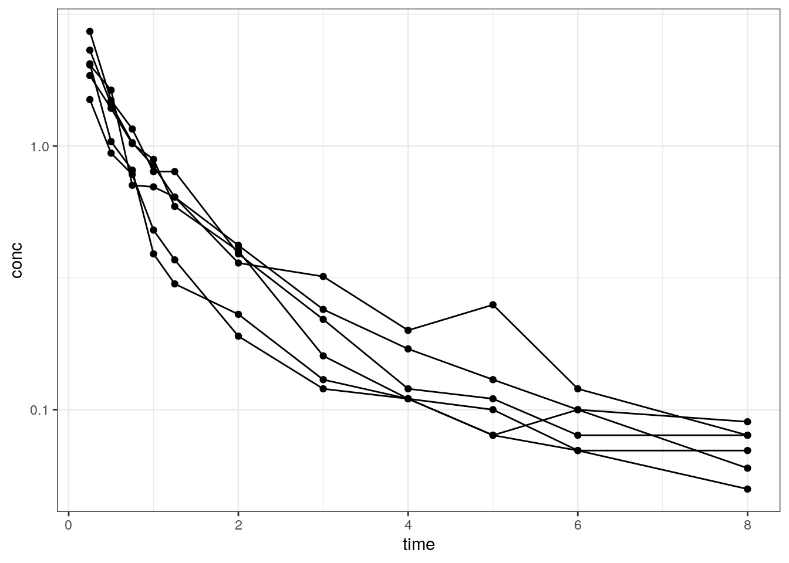
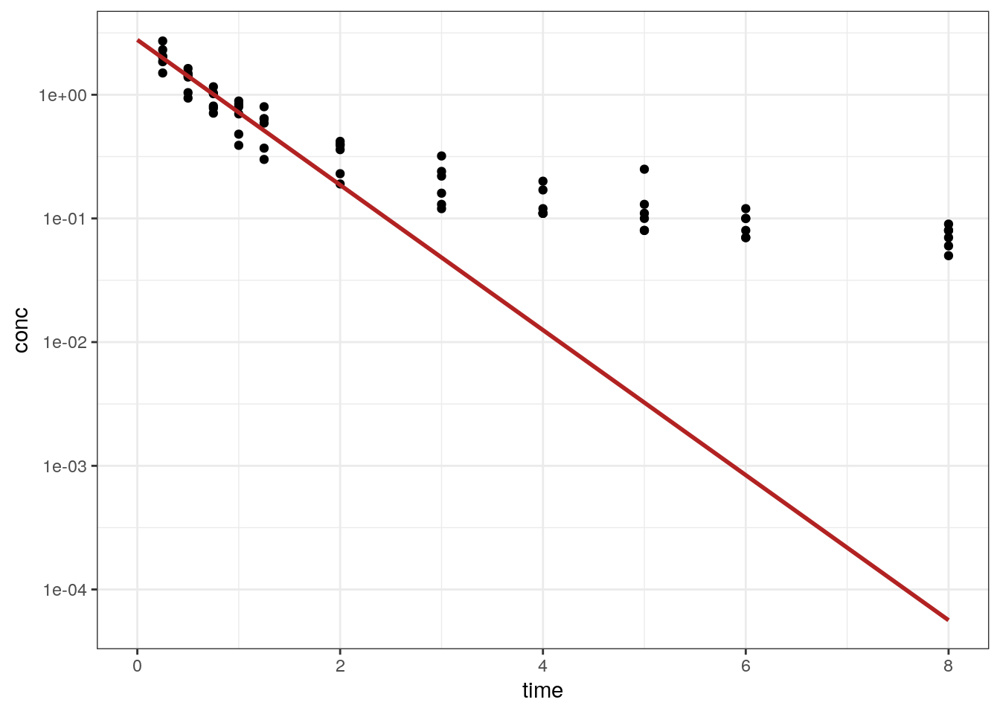
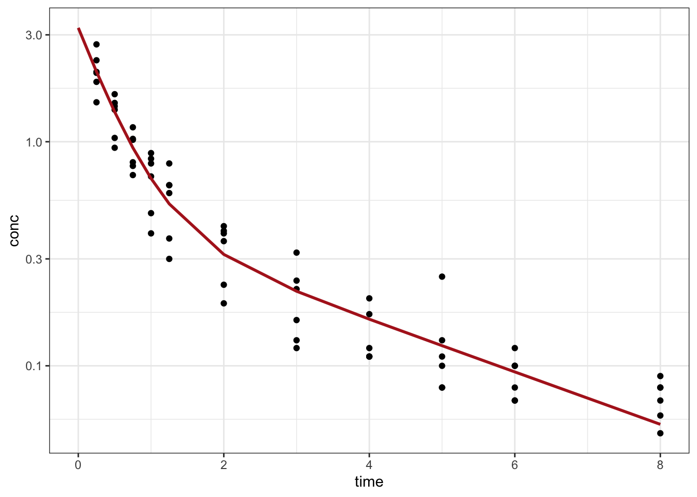
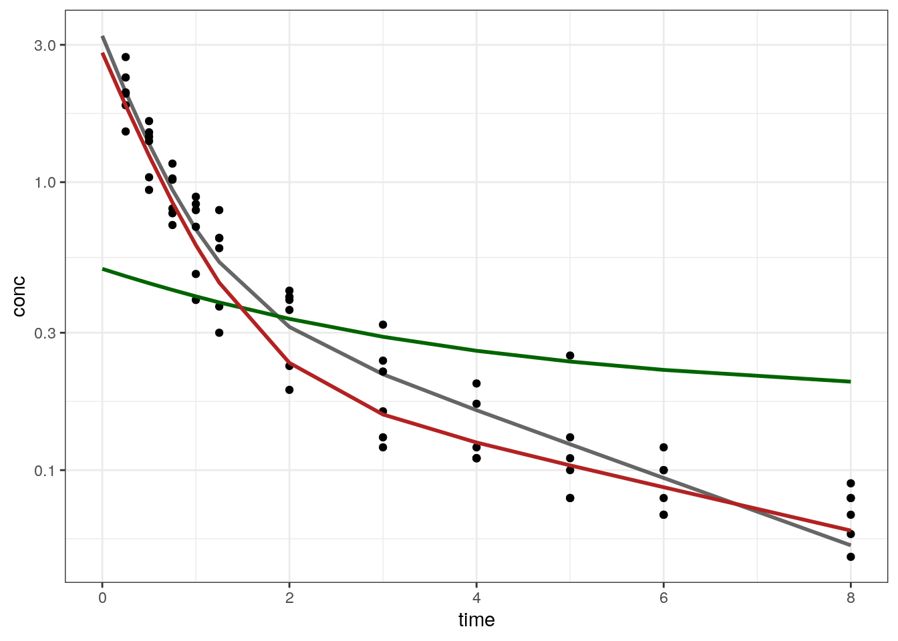

Pooled analysis of indomethacin PK data
================
Metrum Research Group

  - [Packages](#packages)
  - [Load indomethacin data set](#load-indomethacin-data-set)
  - [Data assembly](#data-assembly)
  - [Create an objective function
    function](#create-an-objective-function-function)
  - [Load a PK model](#load-a-pk-model)
  - [Fit with one-compartment model](#fit-with-one-compartment-model)
  - [Make a plot of the output](#make-a-plot-of-the-output)
  - [Your turn](#your-turn)
  - [Answer](#answer)
      - [Fit the data with
        `RcppDE::DEoptim`](#fit-the-data-with-rcppdedeoptim)
      - [Check the estimates and the final value of the objective
        function](#check-the-estimates-and-the-final-value-of-the-objective-function)
  - [Some global search with NLOPTR](#some-global-search-with-nloptr)

# Packages

``` r
library(tidyverse)
theme_set(theme_bw())
library(mrgsolve)
```

# Load indomethacin data set

``` r
data(Indometh)
```

  - Take a look at what is there

<!-- end list -->

``` r
head(Indometh)
```

    . Grouped Data: conc ~ time | Subject
    .   Subject time conc
    . 1       1 0.25 1.50
    . 2       1 0.50 0.94
    . 3       1 0.75 0.78
    . 4       1 1.00 0.48
    . 5       1 1.25 0.37
    . 6       1 2.00 0.19

``` r
count(Indometh, Subject)
```

    . # A tibble: 6 x 2
    .   Subject     n
    .   <ord>   <int>
    . 1 1          11
    . 2 4          11
    . 3 2          11
    . 4 5          11
    . 5 6          11
    . 6 3          11

``` r
ggplot(Indometh, aes(time,conc,group=Subject)) + 
  geom_point() + geom_line() +
  scale_y_continuous(trans = "log", breaks = 10^seq(-4,4))
```

<!-- -->

This is individual-level data, but we are going to do naive pooled
analysis.

# Data assembly

``` r
data <- readRDS("data/indometh.RDS")

head(data)
```

    .   time conc evid cmt ID amt
    . 1 0.00   NA    1   2  1  25
    . 2 0.25 1.50    0   0  1  NA
    . 3 0.50 0.94    0   0  1  NA
    . 4 0.75 0.78    0   0  1  NA
    . 5 1.00 0.48    0   0  1  NA
    . 6 1.25 0.37    0   0  1  NA

# Create an objective function function

  - For starters, just do OLS estimation
  - Note that we *need* to name the parameters `p`
      - Parameter updates require names in `mrgsolve`
      - Generally, don’t expect `p` to retain any names that you might
        pass in through the initial estimates
  - We also pass in the `data` and the dependent variable (`dv`)

<!-- end list -->

``` r
obj <- function(p, theta, data, dv ="conc", pred = FALSE) {
  
  names(p) <- names(theta)
  
  p <- lapply(p,exp)
  
  mod <- param(mod, p)
  
  out <- mod %>% param(p) %>% mrgsim_q(data, output="df")
  
  if(pred) return(out)
  
  sqr <- (out[["CP"]] - data[[dv]])^2
  
  sum(sqr, na.rm=TRUE)
}
```

# Load a PK model

  - We’ll try out one-compartment first

<!-- end list -->

``` r
mod <- modlib("pk1")

param(mod)
```

    . 
    .  Model parameters (N=3):
    .  name value . name value
    .  CL   1     | V    20   
    .  KA   1     | .    .

# Fit with one-compartment model

  - First generate some initial estimates
  - These *need* to be named in a way that is consistent with the model
    we are using
  - I usually run a test with the objective function function to make
    sure the logic works out

<!-- end list -->

``` r
theta <- log(c(CL = 1, V = 100))

obj(theta,theta,data)
```

    . [1] 33.69619

  - Nelder-Mead optimization

<!-- end list -->

``` r
fit <- optim(par = theta, fn=obj, theta = theta, data=data)
```

  - And generate some predictions based on the final estimates

<!-- end list -->

``` r
pred <- obj(fit$par, theta, data, pred = TRUE)

data$pred <- pred$CP

head(data)
```

    .   time conc evid cmt ID amt      pred
    . 1 0.00   NA    1   2  1  25 2.7771715
    . 2 0.25 1.50    0   0  1  NA 1.9814023
    . 3 0.50 0.94    0   0  1  NA 1.4136524
    . 4 0.75 0.78    0   0  1  NA 1.0085852
    . 5 1.00 0.48    0   0  1  NA 0.7195857
    . 6 1.25 0.37    0   0  1  NA 0.5133960

# Make a plot of the output

  - What do you think? Good fit?

<!-- end list -->

``` r
ggplot(data = data) + 
  geom_point(aes(time,conc)) + 
  scale_y_log10() + 
  geom_line(aes(time,pred),col="firebrick", lwd=1)
```

<!-- -->

# Your turn

  - Try fitting the same indomethacin data with a 2-compartment model

<!-- end list -->

``` r
mod <- modlib("pk2")
```

  - Take a look at the model and generate a call to `minqa::newuoa`
    using the OLS objective function above to fit the data

  - You will also need try out a new set of initial estimates for all of
    the volumes and clearances for 2-compartment, IV bolus model

  - What do you think of the fit using the the OLS objective function?
    
      - Can you make a simple modification to the OLS objective function
        that might make the fit look a little better?

  - Suppose we’re worried about the `newuoa` optimizer and want to try a
    global search algorithm
    
      - Can you construct a call to `RcppDE::DEoptim` that will also fit
        the data?
      - Remember that `DEoptim` doesn’t use initial estimates the same
        way `stats::optim` or `minqa::newuoa` does; you have to specify
        one vector of lower boundaries and one vector of upper
        boundaries, with a lower and upper bound for each parameter

# Answer

  - Set the initial estimates for two compartment model

<!-- end list -->

``` r
param(mod)
```

    . 
    .  Model parameters (N=5):
    .  name value . name value
    .  CL   1     | V2   20   
    .  KA   1     | V3   10   
    .  Q    2     | .    .

``` r
theta <- log(c(CL = 2, V2 = 50, Q = 10, V3 = 50))
```

``` r
fit <- optim(par = theta, fn=obj, theta = theta, data=data)
```

  - And generate some predictions based on the final estimates

<!-- end list -->

``` r
pred <- obj(fit$par, theta, data, pred = TRUE)

data$pred <- pred$CP

ggplot(data = data) + 
  geom_point(aes(time,conc)) + 
  scale_y_log10() + 
  geom_line(aes(time,pred),col="firebrick", lwd=1)
```

    . Warning: Removed 6 rows containing missing values (geom_point).

<!-- -->

  - Try weighted least squares

<!-- end list -->

``` r
obj <- function(p, theta, data, wt, pred = FALSE) {
  names(p) <- names(theta)
  p <- lapply(p,exp)
  out <- mod %>% param(p) %>% mrgsim_q(data, output="df")
  if(pred) return(out)
  return(sum(((out$CP - data[["conc"]])*wt)^2, na.rm=TRUE))
}
```

``` r
dv <- data[["conc"]]

fit_wt <- minqa::newuoa(par = theta, fn=obj, theta = theta, data=data, wt=1/dv)
```

Final estimates and final value of objective function

``` r
exp(fit_wt$par)
```

    . [1]  8.926545  8.873479  6.319330 19.684318

``` r
obj(fit_wt$par,theta,data,dv)
```

    . [1] 8.630392

  - Generate predictions for the final and initial estimates

<!-- end list -->

``` r
pred <-  obj(fit$par, theta, data, wt = 1/dv, pred = TRUE)
predi <- obj(theta,  theta, data, wt = 1/dv, pred = TRUE)
predw <- obj(fit_wt$par, theta, data, wt = 1/dv, pred = TRUE) 


data$pred <- pred$CP
data$predi <- predi$CP
data$predw <- predw$CP
head(data)
```

    .   time conc evid cmt ID amt      pred     predi     predw
    . 1 0.00   NA    1   2  1  25 3.2236198 0.5000000 2.8173842
    . 2 0.25 1.50    0   0  1  NA 2.0547326 0.4714730 1.8483732
    . 3 0.50 0.94    0   0  1  NA 1.3586833 0.4456942 1.2371868
    . 4 0.75 0.78    0   0  1  NA 0.9405602 0.4223898 0.8505654
    . 5 1.00 0.48    0   0  1  NA 0.6860398 0.4013128 0.6049255
    . 6 1.25 0.37    0   0  1  NA 0.5280509 0.3822414 0.4478397

  - Plot the predictions

<!-- end list -->

``` r
pred <- distinct(data, time, .keep_all = TRUE)

ggplot(data = data) + 
  geom_point(aes(time,conc)) + 
  scale_y_log10() + 
  geom_line(data=pred,aes(time,pred),col="black", lwd=1, alpha = 0.6) +
  geom_line(data=pred,aes(time,predi),col="darkgreen", lwd=1) + 
  geom_line(data = pred, aes(time,predw), col="firebrick", lwd = 1)
```

    . Warning: Removed 6 rows containing missing values (geom_point).

<!-- -->

## Fit the data with `RcppDE::DEoptim`

``` r
fit <- DEoptim::DEoptim(
  obj, 
  lower = rep(-4,4), 
  upper = rep(4,4), 
  theta = theta, data = data, wt = 1/dv, 
  control = DEoptim.control(itermax=120,trace=20)
)
```

## Check the estimates and the final value of the objective function

``` r
tibble(
  DE = exp(fit$optim$bestmem), 
  Nelder = exp(fit_wt$par)
)

tibble(
  DE = obj(fit$optim$bestmem, theta,data,1/dv),
  Nelder = obj(fit_wt$par, theta, data, 1/dv)
)
```

# Some global search with NLOPTR

<https://nlopt.readthedocs.io/en/latest/NLopt_Algorithms/>

``` r
library(nloptr)
a0 <- obj(theta,theta=theta,data=data,wt = 1/dv, pred = FALSE)

lowr <- rep(-5,length(theta))
uppr <- rep(5, length(theta))

x <- isres(
  x0 = theta, 
  fn=obj, 
  lower = lowr, 
  upper = uppr, 
  theta=theta, 
  data=data, 
  wt = 1/dv, 
  maxeval=10000
)

y <- crs2lm(
  x0 = theta, 
  fn=obj, 
  lower = lowr, 
  upper = uppr, 
  theta=theta, 
  data=data, 
  wt = 1/dv, 
  maxeval=500
)

z <- newuoa(x0 = y$par, fn = obj,theta = theta, data = data, wt = 1/dv)


tibble(a0 = theta, a = fit_wt$par, x = x$par, y = y$par, z= z$par) %>% exp
tibble(a0 = a0,a = fit_wt$fval, x = x$value, y= y$value, z = z$value)


direct <- directL( 
  fn = obj, 
  lower = lowr, 
  upper = uppr, 
  theta = theta, 
  data = data, 
  wt = 1/dv, 
  control = list(maxeval=2500)
)


tibble(a0 = theta, a = fit_wt$par, x = x$par, y = y$par, z= z$par,d = direct$par) %>% exp
tibble(a0 = a0,a = fit_wt$fval, x = x$value, y= y$value, z = z$value, d = direct$value)
```
