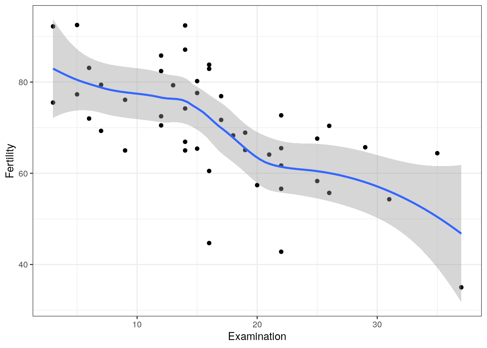
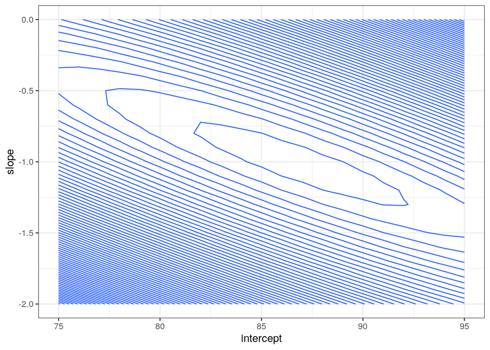
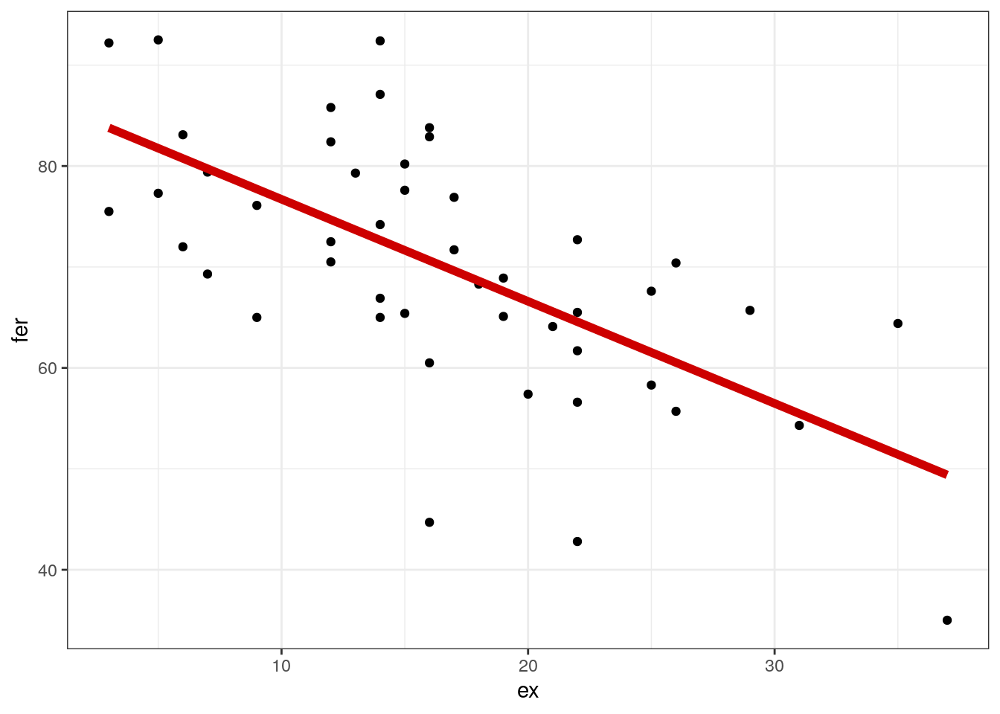
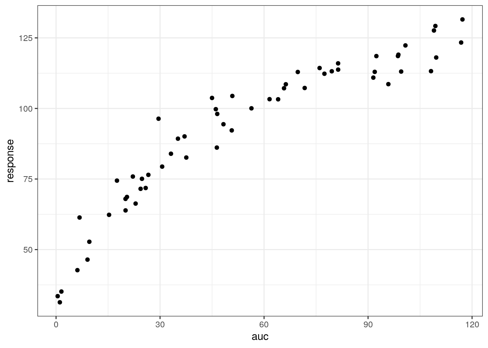

Introduction to parameter optimization
================
Metrum Research Group

  - [Swiss Fertility and Socioeconomic
    Indicators](#swiss-fertility-and-socioeconomic-indicators)
  - [Optimization the `R` way](#optimization-the-r-way)
      - [Model](#model)
      - [Data](#data)
      - [Objective function](#objective-function)
      - [Parameter search](#parameter-search)
      - [Optimize](#optimize)
  - [Use other optimizers](#use-other-optimizers)
      - [`minqa::newuoa`](#minqanewuoa)
      - [DEoptim](#deoptim)
  - [Maximum likelihood estimation](#maximum-likelihood-estimation)
  - [Extended least squares](#extended-least-squares)
  - [Get standard error of estimate](#get-standard-error-of-estimate)
  - [Plot predicted and observed
    values](#plot-predicted-and-observed-values)
  - [Let’s try it](#lets-try-it)

``` r
library(tidyverse)
```

    ## Warning: replacing previous import 'vctrs::data_frame' by 'tibble::data_frame'
    ## when loading 'dplyr'

``` r
library(broom)
library(ggplot2)
theme_set(theme_bw())
```

# Swiss Fertility and Socioeconomic Indicators

We’ll get started with the introduciton to optimization with an easy
data set and an easy model.

Data were collected from 47 French-speaking provences around 1888.

``` r
data(swiss)
glimpse(swiss, width = 60, strict.width="cut")
```

    . Rows: 47
    . Columns: 6
    . $ Fertility        <dbl> 80.2, 83.1, 92.5, 85.8, 76.9, 76…
    . $ Agriculture      <dbl> 17.0, 45.1, 39.7, 36.5, 43.5, 35…
    . $ Examination      <int> 15, 6, 5, 12, 17, 9, 16, 14, 12,…
    . $ Education        <int> 12, 9, 5, 7, 15, 7, 7, 8, 7, 13,…
    . $ Catholic         <dbl> 9.96, 84.84, 93.40, 33.77, 5.16,…
    . $ Infant.Mortality <dbl> 22.2, 22.2, 20.2, 20.3, 20.6, 26…

``` r
ggplot(swiss, aes(Examination,Fertility)) + geom_point() + geom_smooth()
```



We’ll work on a regression model for the standardized fertility measure
(dependent variable) as function of the `Examination` predictor (percent
draftees receiving highest mark on army examination).

Usually we’d fit this model in R like this:

``` r
fit <- lm(Fertility ~ Examination, swiss) 

tidy(fit)
```

    . # A tibble: 2 x 5
    .   term        estimate std.error statistic  p.value
    .   <chr>          <dbl>     <dbl>     <dbl>    <dbl>
    . 1 (Intercept)    86.8      3.26      26.7  3.35e-29
    . 2 Examination    -1.01     0.178     -5.68 9.45e- 7

Using `lm` is the “right” way to model this data. We’re going to write
come code that also get parameters for this data. But we’ll put all of
the pieces together ourselves. So this isn’t the proper way to get these
parameter estimates. But this simple example will help us better
understand the mechanics of parameter optimization in R.

# Optimization the `R` way

We’ll need

1.  A **model**
      - The model generates the data (dependent variable) based on
        parameters and predictors
2.  Some **data**
      - Using `swiss` for now
3.  An **objective function**
      - To quantify how consistent a set of parameters are with the
        observed data
4.  An **optimizer**
      - Search the parameter space for most optimal parameter value

## Model

The parameters are

  - `intercept`
  - `slope`

And the predictor is `ex` … in our example `Examination`

This is pretty simple stuff. But we’ll wrap it up in a function to call
like this:

``` r
linear_model <- function(intercept, slope, ex) {
  intercept + slope * ex
}
```

So we can get the predicted `Fertility` by passing in the intercept,
slope, and the `Examination` value

E(y|x)

``` r
linear_model(intercept = 90, slope = -2, ex = 20)
```

    . [1] 50

## Data

How you want to set this up is a bit dependent on your application. I’m
going to get vectors called `ex` for the `Examination` value (predictor)
and `fer` for `Fertility` (the dependent variable).

``` r
ex <- swiss[["Examination"]]

fer <- swiss[["Fertility"]]
```

## Objective function

We’ll write this function so that

1.  The first argument is `par`, the parameters we want to evaluate
      - Par will be a vector of length 2, the intercept and the slope
2.  We will also pass in the predictor (`ex`) and the data (`fer`),
    which we’ll need to calculate the objective function

<!-- end list -->

``` r
ofv <- function(par, ex, fer) {
  
  fer_hat <- linear_model(par[1], par[2], ex)
  
  sum((fer-fer_hat)^2)
}
```

This is an *O* rdinary *L* east *S* quares objective function.

Working backward:

1.  We return the squared difference between the predicted values
    (`fer_hat`) and the data
2.  We generate the predicted values from our linear model function, the
    proposed parameters and the data
3.  The optimizer will propose a set of parameters for us to evaluate

Let’s test the objective function

``` r
theta <- c(70, -2)

ofv(theta, ex, fer)
```

    . [1] 58605.31

Good or bad? Looking back at the data, the intercept doesn’t look like
it is 70 … more like 80. Let’s try that:

``` r
theta <- c(80,-2)

ofv(theta, ex, fer)
```

    . [1] 32171.31

Ok the objective function is lower now. The second set of parameters we
tried looks better than the first set.

What about slope?

``` r
theta <- c(80,-1.5)

ofv(theta, ex, fer)
```

    . [1] 15284.46

This is even better. But we can’t keep going like this.

## Parameter search

Let’s do this for a big batch of parameters

  - intercept from 75 to 95
  - slope from -2 to 0

<!-- end list -->

``` r
test <- expand.grid(intercept = seq(75,95,1), slope = seq(-2,0,0.1))

head(test)
```

    .   intercept slope
    . 1        75    -2
    . 2        76    -2
    . 3        77    -2
    . 4        78    -2
    . 5        79    -2
    . 6        80    -2

Now calculate the value of the objective function for each paramter set

``` r
test <- mutate(
  test, 
  value = pmap_dbl(test, .f=function(intercept,slope) {
    ofv(c(intercept,slope), ex = ex, fer = fer)
  })
)

arrange(test,value) %>% head
```

    .   intercept slope   value
    . 1        87  -1.0 4190.31
    . 2        86  -1.0 4202.71
    . 3        88  -1.1 4210.30
    . 4        85  -0.9 4219.86
    . 5        89  -1.1 4230.90
    . 6        84  -0.9 4265.26

``` r
ggplot(test) + geom_contour(aes(intercept,slope,z=value),bins=80)
```



## Optimize

We know there is a set of parameters that really gets us the smallest
value of the objective function and are therefor the “optimal”
parameters.

We invoke an optizer in R to search the parameter space and find that
set of parameters.

Start with an optimizer that comes with R in the `stats` package.
`optim` by default does Nelder-Mead optimization algorithm.

When we call `optim`, we have to give an inital guess (`par`) and the
function to minimize (`ofv`). We also pass in the predictor and the
vector of observed data so we can calculate the sum of squares.

``` r
fit <- optim(c(100,1), ofv, ex = ex, fer = fer)
```

``` r
fit$par
```

    . [1] 86.822915 -1.011682

``` r
lm(Fertility~Examination, swiss) 
```

    . 
    . Call:
    . lm(formula = Fertility ~ Examination, data = swiss)
    . 
    . Coefficients:
    . (Intercept)  Examination  
    .      86.819       -1.011

# Use other optimizers

## `minqa::newuoa`

``` r
library(minqa)

fit <- newuoa(theta, ofv, ex = ex, fer = fer, control = list(iprint=20))
```

    . npt = 4 , n =  2 
    . rhobeg =  0.95 , rhoend =  9.5e-07 
    . start par. =  80 -1.5 fn =  15284.46 
    . rho:    0.095 eval:   5 fn:      4835.84 par: 80.0000 -0.550000 
    .  20:     4319.4571:  83.2325 -0.872836
    . rho:   0.0095 eval:  24 fn:      4250.71 par: 84.0677 -0.868220 
    .  40:     4188.6677:  86.0555 -0.973636
    . rho:  0.00095 eval:  55 fn:      4184.30 par: 86.6095 -1.00569 
    .  60:     4183.8628:  86.6348 -1.00216
    . rho:  9.5e-05 eval:  74 fn:      4183.57 par: 86.8189 -1.01133 
    . rho:  9.5e-06 eval:  78 fn:      4183.57 par: 86.8185 -1.01131 
    .  80:     4183.5671:  86.8185 -1.01132
    . rho:  9.5e-07 eval:  81 fn:      4183.57 par: 86.8185 -1.01131 
    . At return
    . eval:  89 fn:      4183.5671 par:  86.8185 -1.01132

``` r
fit$par
```

    . [1] 86.818529 -1.011317

## DEoptim

Differential evolution algorithm

``` r
library(DEoptim)

lower <- c(intercept=0, slope=-100)
upper <- c(intercept = 1000, slope=100)

con <- DEoptim.control(itermax = 80, trace = 2)

set.seed(112233)
fit <- DEoptim(ofv, lower, upper, ex = ex, fer = fer, control = con)
```

    . Iteration: 2 bestvalit: 318953.193160 bestmemit:  265.976666   -8.389177
    . Iteration: 4 bestvalit: 150708.467549 bestmemit:  213.881420   -7.849656
    . Iteration: 6 bestvalit: 67109.936741 bestmemit:  150.706030   -2.848407
    . Iteration: 8 bestvalit: 20714.032107 bestmemit:   90.987682   -0.195885
    . Iteration: 10 bestvalit: 20714.032107 bestmemit:   90.987682   -0.195885
    . Iteration: 12 bestvalit: 4444.885030 bestmemit:   90.987682   -1.133708
    . Iteration: 14 bestvalit: 4444.885030 bestmemit:   90.987682   -1.133708
    . Iteration: 16 bestvalit: 4444.885030 bestmemit:   90.987682   -1.133708
    . Iteration: 18 bestvalit: 4444.885030 bestmemit:   90.987682   -1.133708
    . Iteration: 20 bestvalit: 4214.123010 bestmemit:   85.878019   -0.926806
    . Iteration: 22 bestvalit: 4214.123010 bestmemit:   85.878019   -0.926806
    . Iteration: 24 bestvalit: 4214.123010 bestmemit:   85.878019   -0.926806
    . Iteration: 26 bestvalit: 4214.123010 bestmemit:   85.878019   -0.926806
    . Iteration: 28 bestvalit: 4214.123010 bestmemit:   85.878019   -0.926806
    . Iteration: 30 bestvalit: 4194.444474 bestmemit:   87.819083   -1.072268
    . Iteration: 32 bestvalit: 4183.716589 bestmemit:   86.949012   -1.017892
    . Iteration: 34 bestvalit: 4183.716589 bestmemit:   86.949012   -1.017892
    . Iteration: 36 bestvalit: 4183.716589 bestmemit:   86.949012   -1.017892
    . Iteration: 38 bestvalit: 4183.716589 bestmemit:   86.949012   -1.017892
    . Iteration: 40 bestvalit: 4183.716589 bestmemit:   86.949012   -1.017892
    . Iteration: 42 bestvalit: 4183.687877 bestmemit:   86.935280   -1.017368
    . Iteration: 44 bestvalit: 4183.599647 bestmemit:   86.759307   -1.008059
    . Iteration: 46 bestvalit: 4183.594865 bestmemit:   86.768295   -1.008241
    . Iteration: 48 bestvalit: 4183.594865 bestmemit:   86.768295   -1.008241
    . Iteration: 50 bestvalit: 4183.567802 bestmemit:   86.823236   -1.011722
    . Iteration: 52 bestvalit: 4183.567474 bestmemit:   86.813777   -1.011176
    . Iteration: 54 bestvalit: 4183.567474 bestmemit:   86.813777   -1.011176
    . Iteration: 56 bestvalit: 4183.567474 bestmemit:   86.813777   -1.011176
    . Iteration: 58 bestvalit: 4183.567347 bestmemit:   86.817505   -1.011155
    . Iteration: 60 bestvalit: 4183.567254 bestmemit:   86.814953   -1.011134
    . Iteration: 62 bestvalit: 4183.567149 bestmemit:   86.819223   -1.011336
    . Iteration: 64 bestvalit: 4183.567149 bestmemit:   86.819223   -1.011336
    . Iteration: 66 bestvalit: 4183.567149 bestmemit:   86.819223   -1.011336
    . Iteration: 68 bestvalit: 4183.567149 bestmemit:   86.819223   -1.011336
    . Iteration: 70 bestvalit: 4183.567146 bestmemit:   86.817748   -1.011278
    . Iteration: 72 bestvalit: 4183.567146 bestmemit:   86.817748   -1.011278
    . Iteration: 74 bestvalit: 4183.567144 bestmemit:   86.818997   -1.011346
    . Iteration: 76 bestvalit: 4183.567143 bestmemit:   86.818129   -1.011302
    . Iteration: 78 bestvalit: 4183.567141 bestmemit:   86.818502   -1.011316
    . Iteration: 80 bestvalit: 4183.567141 bestmemit:   86.818502   -1.011316

# Maximum likelihood estimation

Let’s write a new (R) function where we optimize based on a normal
likelihood function.

The arguments are the same as the OLS function. Now, rather than
comparing predictions against data using sum of squares, we compare
based on normal likelihood function.

``` r
ml <- function(p, ex, fer) {
  
  fer_hat <- linear_model(p[1], p[2], ex)
  
  like <- dnorm(fer, fer_hat, p[3], log = TRUE)
  
  -1*sum(like)
}
```

**Note**

1.  We have an extra parameter now … the standard deviation for
    likelihood function
2.  We use `log=TRUE` to get the log likelihood; then the joint
    likelihood of all the data is the sum of the individual likelihoods
3.  We return minus-1 times the log likelihood; we are doing *maximum*
    likelihood but the optimizers find the *minimum* of a function

Test the function now

``` r
theta <- c(intercept = 10, slope = 1, sd = 2)

ml(theta, ex, fer)
```

    . [1] 13274.61

And we get the same answer

``` r
fit <- newuoa(theta, ml, ex = ex, fer = fer)

fit$par
```

    . [1] 86.818530 -1.011317  9.434621

``` r
fit$fval
```

    . [1] 172.1763

# Extended least squares

``` r
els <- function(p, ex, fer) {
  
  fer_hat <- linear_model(p[1], p[2], ex)
  
  0.5 * sum((fer - fer_hat)^2/p[3] + log(p[3]))
}
```

``` r
fit.els <- newuoa(theta, els, ex = ex, fer = fer)

fit.els$par
```

    . [1] 86.818523 -1.011317 89.012071

``` r
fit.els$fval
```

    . [1] 128.9861

# Get standard error of estimate

We use `numDeriv::hessian` to get the hessian

``` r
library(numDeriv)

he <- hessian(ml, fit$par, ex = ex, fer = fer)

he
```

    .               [,1]         [,2]          [,3]
    . [1,]  5.280182e-01 8.706684e+00 -4.878745e-09
    . [2,]  8.706684e+00 1.764592e+02  2.751098e-07
    . [3,] -4.878745e-09 2.751098e-07  1.056036e+00

To derive the standard error

1.  Invert the hessian matrix
2.  Get the diagonal elements
3.  Take the squre root

<!-- end list -->

``` r
he %>% solve() %>% diag() %>% sqrt()
```

    . [1] 3.1875394 0.1743644 0.9731070

And compare against the answer we got from `lm`

``` r
lm(Fertility ~ Examination, data = swiss) %>% 
  tidy() %>% 
  pull(std.error)
```

    . [1] 3.2576034 0.1781971

You can also try `nlme::fdHess`

``` r
library(nlme)

he <- fdHess(pars  = fit$par, fun = ml, ex = ex, fer = fer)

he$Hessian %>% solve() %>% diag() %>% sqrt()
```

    . [1] 3.1875681 0.1743662 0.9731027

In my experience, it is frequently necessary to just bootstrap the data
set. We will look at likelihood profile in a separate vignette.

# Plot predicted and observed values

Take the final parameter estimates

``` r
fit$par
```

    . [1] 86.818530 -1.011317  9.434621

and pass them into our `linear_model` to generate predicted values.

``` r
data <- tibble(
  ex = ex, 
  fer = fer, 
  pred = linear_model(fit$par[1], fit$par[2], ex)
)
```

``` r
ggplot(data = data) + 
  geom_point(aes(x =  ex, y = fer)) +
  geom_line(aes(x = ex, y = pred), lwd = 2, col="red3") 
```



# Let’s try it

``` r
data <- readRDS("data/pdfit.RDS")

head(data)
```

    . # A tibble: 6 x 2
    .     auc response
    .   <dbl>    <dbl>
    . 1  66.3    109. 
    . 2  22.9     66.3
    . 3  22.2     75.9
    . 4  81.4    116. 
    . 5 109.     129. 
    . 6  98.6    119.

``` r
ggplot(data, aes(auc,response)) + geom_point()
```


