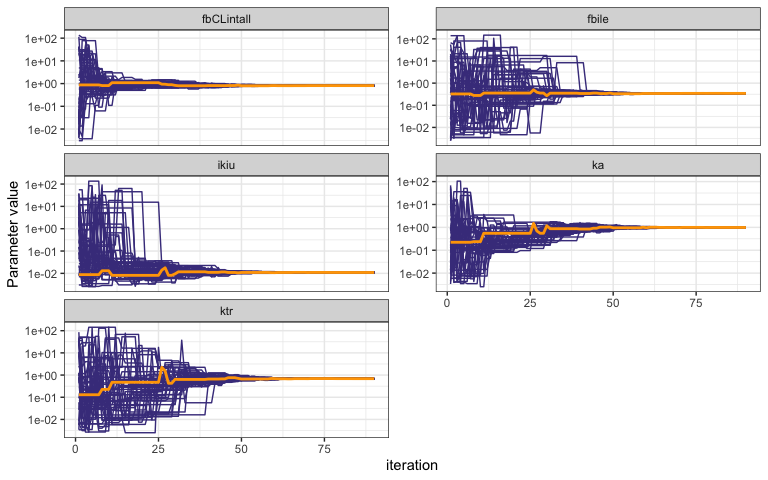

Estimate parameters in a PBPK model
================
Metrum Research Group

  - [Packages and setup](#packages-and-setup)
  - [Reference](#reference)
  - [Data](#data)
  - [PBPK model: pitavastatin / CsA
    DDI](#pbpk-model-pitavastatin-csa-ddi)
  - [Objective function](#objective-function)
      - [Prediction function](#prediction-function)
  - [Data grooming](#data-grooming)
  - [Optimize](#optimize)
      - [`nloptr::newuoa`: minimization without
        derivatives](#nloptrnewuoa-minimization-without-derivatives)
          - [The final objective function value and
            estimates](#the-final-objective-function-value-and-estimates)
      - [`optim`: Nelder-Mead](#optim-nelder-mead)
      - [`neldermead`: Alternate
        Nelder-Mead](#neldermead-alternate-nelder-mead)
      - [`DEoptim`: differential evolution
        algorithm](#deoptim-differential-evolution-algorithm)
          - [DA for the plot](#da-for-the-plot)
      - [`GenSA`: simulated annealing](#gensa-simulated-annealing)
      - [`hydroPSO`: particle swarm
        optimization](#hydropso-particle-swarm-optimization)
      - [`nloptr::CRS`: controlled random
        search](#nloptrcrs-controlled-random-search)
  - [Compare optimization methods](#compare-optimization-methods)

# Packages and setup

``` r
library(tidyverse)
library(PKPDmisc)
library(mrgsolve)
library(nloptr)
library(DEoptim)
library(GenSA)
library(hydroPSO)
source("script/functions.R")
source("script/global.R")
```

``` r
set.seed(10101)
```

``` r
theme_set(theme_bw() + theme(legend.position = "top"))
scale_colour_discrete <- function(...) scale_color_brewer(palette="Set2")
```

Models are located here:

``` r
model_dir <- "model"
```

# Reference

**Quantitative Analyses of Hepatic OATP-Mediated Interactions Between
Statins and Inhibitors Using PBPK Modeling With a Parameter Optimization
Method**

  - T Yoshikado, K Yoshida, N Kotani, T Nakada, R Asaumi, K Toshimoto, K
    Maeda, H Kusuhara and Y Sugiyama

  - CLINICAL PHARMACOLOGY & THERAPEUTICS | VOLUME 100 NUMBER 5 |
    NOVEMBER 2016

  - <https://www.ncbi.nlm.nih.gov/pubmed/27170342>

# Data

  - Example taken from figure 4a from the publication
  - Using this as example data to fit

<!-- end list -->

``` r
data.file <- "data/fig4a.csv"

data <-
  data.file %>% 
  read_csv() %>% 
  mutate(
    profile = NULL, 
    type=ID, 
    typef=factor(ID, labels = c("Statin", "Statin+CsA")), 
    DV = ifelse(DV==-1, NA_real_, DV)
  )
```

  - The goal is to fit the pitavastatin data either alone or in
    combination with cyclosporin administered 1 hour before the
    pitavastatin

<!-- end list -->

``` r
ggplot(data=data,aes(time,DV)) + 
  geom_point(aes(col = typef), size = 3) + 
  geom_line(col = "darkgrey", aes(group = typef)) + 
  scale_y_continuous(trans="log", limits=c(0.1,300), breaks=logbr()) 
```


# PBPK model: pitavastatin / CsA DDI

  - Check out the model / data with a quick simulation

<!-- end list -->

``` r
mod <- mread_cache("yoshikado", model_dir)
```

Make some persistent updates to the model

  - Simulate out to 14 hours
  - Only interested in `CP`, the pitavastatin concentration

<!-- end list -->

``` r
mod <- mod %>% update(end=14, delta=0.1) %>% Req(CP) 
```

A practice simulation

``` r
dose <- filter(data, evid==1) %>% mutate(typef=NULL)

sims <- 
  mod %>% 
  mrgsim_d(dose, obsaug=TRUE) %>% 
  mutate(type = typef(ID))

ggplot(sims, aes(time,CP,col=type)) + 
  geom_line(lwd = 1) + 
  scale_x_continuous(breaks = seq(0,12,2)) + 
  scale_y_log10(name = "Pitavastatin concentration")
```


``` r
sims %>% 
  group_by(type) %>% 
  summarise(auc = auc_partial(time,CP)) %>% 
  mutate(fold_increase = auc /first(auc))
```

    . # A tibble: 2 x 3
    .   type                 auc fold_increase
    .   <fct>              <dbl>         <dbl>
    . 1 Pitavastatin alone  44.1          1   
    . 2 Pitavastatin + CsA 161.           3.65

# Objective function

  - Least squares objective function
  - Weighted by the observations

Arguments:

  - `dv` the observed data
  - `pred` the predicted data

<!-- end list -->

``` r
wss <- function(dv, pred, weight = 1/dv) {
  sum(((dv-pred)*weight)^2,na.rm=TRUE) 
}
```

#### Prediction function

  - Let’s go through step by step what each line is doing for us

Arguments:

  - `p` the parameters proposed by the optimizer
  - `data` the simulation template (doses and observation records)
  - `pred` logical; if `TRUE`, just return predicted data

<!-- end list -->

``` r
sim_ofv <- function(p, data, pred = FALSE) {
  
  names(p) <- names(theta)
  
  p <- lapply(p,exp)
  
  out <- mod %>% param(p) %>% mrgsim_q(data, output="df")
  
  if(pred) return(out)
  
  ofv <- wss(data[["DV"]], out[["CP"]])
  
  return(ofv)
  
}
```

What this function does:

1.  Take in arguments; focus is on a new set of parameters `p` proposed
    by the optimizer; other arguments are just fixed data that we need
2.  Get the parameters out of log scale
3.  Also, put names on the list of parameters; this is crutial
4.  Update the model object with the new parameters
5.  (optionally simulate and return)
6.  Simulate from the data set, taking only observed values
7.  Calculate and return the objective function value

# Data grooming

  - Drop the non-numeric columns

<!-- end list -->

``` r
data <-  dplyr::select(data, -typef)
```

# Optimize

First, set up the initial estimates

``` r
theta <- c(
  fbCLintall = 1, 
  ikiu = 1, 
  fbile = 0.5, 
  ka = 1, 
  ktr = 1
) %>% log()
```

## `nloptr::newuoa`: minimization without derivatives

``` r
fit <- nloptr::newuoa(x0 = theta, fn = sim_ofv, data = data)
fit
```

    . $par
    . [1] -0.20428246 -4.51446804 -1.06769436 -0.01128541 -0.37159534
    . 
    . $value
    . [1] 0.6860764
    . 
    . $iter
    . [1] 386
    . 
    . $convergence
    . [1] 4
    . 
    . $message
    . [1] "NLOPT_XTOL_REACHED: Optimization stopped because xtol_rel or xtol_abs (above) was reached."

``` r
fit_minqa <- minqa::newuoa(theta, fn = sim_ofv, data = data) 
```

#### The final objective function value and estimates

``` r
sim_ofv(fit$par,data=data)
```

    . [1] 0.6860764

``` r
exp(fit$par) %>% set_names(names(theta))
```

    . fbCLintall       ikiu      fbile         ka        ktr 
    . 0.81523207 0.01094943 0.34380028 0.98877803 0.68963325

## `optim`: Nelder-Mead

``` r
fit1b <- optim(theta, sim_ofv, data=data, control = list(maxit = 1000))
```

## `neldermead`: Alternate Nelder-Mead

``` r
fit1c <- nloptr::neldermead(x0=theta, fn=sim_ofv, data = data )
```

## `DEoptim`: differential evolution algorithm

<https://en.wikipedia.org/wiki/Differential_evolution>

“Performs evolutionary global optimization via the Differential
Evolution algorithm.”

``` r
lower <- rep(-6,length(theta)) %>% setNames(names(theta))
upper <- rep(5, length(theta)) %>% setNames(names(theta))

set.seed(330303)

decontrol <- DEoptim.control(
  trace = 10,
  NP=10*length(theta), 
  CR=0.925, 
  F=0.85,
  itermax=90, 
  storepopfrom=0
)

fit2 <- DEoptim(
  fn=sim_ofv, 
  lower=lower,
  upper=upper, 
  control=decontrol,
  data=data
)
```

    . Iteration: 10 bestvalit: 2.359438 bestmemit:    0.090828   -4.810051   -1.032300   -0.596372   -0.748306
    . Iteration: 20 bestvalit: 2.359438 bestmemit:    0.090828   -4.810051   -1.032300   -0.596372   -0.748306
    . Iteration: 30 bestvalit: 0.745879 bestmemit:   -0.220189   -4.444982   -1.045812   -0.135432   -0.454597
    . Iteration: 40 bestvalit: 0.733471 bestmemit:   -0.201757   -4.500855   -1.075498   -0.170296   -0.414804
    . Iteration: 50 bestvalit: 0.691808 bestmemit:   -0.220169   -4.512342   -1.101670   -0.043517   -0.409125
    . Iteration: 60 bestvalit: 0.688542 bestmemit:   -0.210497   -4.516279   -1.078079    0.011272   -0.380982
    . Iteration: 70 bestvalit: 0.686352 bestmemit:   -0.203172   -4.509802   -1.066623   -0.004658   -0.362483
    . Iteration: 80 bestvalit: 0.686121 bestmemit:   -0.203278   -4.514187   -1.064788   -0.010720   -0.370142
    . Iteration: 90 bestvalit: 0.686081 bestmemit:   -0.204019   -4.514555   -1.067274   -0.011397   -0.372682

#### DA for the plot

``` r
pops <- lapply(fit2$member$storepop, as.data.frame)
hx <- bind_rows(pops)
hx <- mutate(hx, iteration=rep(1:decontrol$itermax,each=decontrol$NP))
hx <- mutate(hx, pop = rep(1:decontrol$NP, time=decontrol$itermax))
hxm <- gather(hx, variable, value, 1:5) %>% mutate(value = exp(value))
best <- as_tibble(fit2$member$bestmemit) %>% 
  mutate(iteration = 1:decontrol$itermax)
bestm <- gather(best,variable,value,1:5) %>% mutate(value = exp(value))
```

``` r
ggplot(data=hxm) + 
  geom_line(aes(iteration,value,group=pop),col="darkslateblue") + 
  geom_line(data=bestm,aes(iteration,value),col="orange",lwd=1) + 
  scale_y_continuous(trans="log", breaks=10^seq(-4,4), name="Parameter value") + 
  facet_wrap(~variable, ncol=2, scales="free_y") + theme_bw()
```



## `GenSA`: simulated annealing

``` r
set.seed(11001)

sacontrol <- list(maxit = 100, nb.stop.improvement = 20, verbose = TRUE)

fit3 <- GenSA(
  NULL, sim_ofv, lower=lower+1, upper=upper-1, data = data, control = sacontrol
)
```

    . Initializing par with random data inside bounds
    . It: 1, obj value: 3.470357641
    . It: 25, obj value: 0.6860778737

## `hydroPSO`: particle swarm optimization

<https://en.wikipedia.org/wiki/Particle_swarm_optimization>

``` r
set.seed(22022013)

fit4 <- hydroPSO(
  theta, fn = sim_ofv, lower = lower, upper = upper, 
  control = list(maxit = 100, REPORT = 5),
  data = data
)
```

## `nloptr::CRS`: controlled random search

``` r
set.seed(11000222)

crs <- crs2lm(
  x0 = theta, 
  fn=sim_ofv, 
  lower = lower, 
  upper = upper, 
  data=data,
  maxeval=5500
)
```

# Compare optimization methods

``` r
results <- list(theta, fit$par, fit1b$par, fit1c$par, fit2$optim$bestmem, fit3$par, fit4$par, crs$par)

results <- map(results, set_names, nm = names(theta))

results <- map(results, exp)

tibble(
  method = c("initial", "newuoa", "nelder", "nelder2", "DEoptim", "SA", "PSO","CRS"),
  fbCLintall = map_dbl(results, "fbCLintall"), 
  ikiu = map_dbl(results, "ikiu"), 
  fbile = map_dbl(results, "fbile"), 
  ka = map_dbl(results, "ka"), 
  ktr = map_dbl(results, "ktr")
) %>% mutate_if(is.double, list(signif), digits = 4)
```

    . # A tibble: 8 x 6
    .   method  fbCLintall   ikiu fbile    ka   ktr
    .   <chr>        <dbl>  <dbl> <dbl> <dbl> <dbl>
    . 1 initial      1     1      0.5   1     1    
    . 2 newuoa       0.815 0.0110 0.344 0.989 0.690
    . 3 nelder       0.815 0.0110 0.344 0.990 0.690
    . 4 nelder2      0.815 0.0110 0.344 0.989 0.690
    . 5 DEoptim      0.815 0.0110 0.344 0.989 0.689
    . 6 SA           0.815 0.0110 0.344 0.989 0.689
    . 7 PSO          0.815 0.0110 0.344 0.988 0.690
    . 8 CRS          0.815 0.0110 0.344 0.989 0.690

``` r
value0 <- sim_ofv(theta,data)
results <- c(value0, fit$value, fit1b$value, fit1c$value, fit2$optim$bestval, fit3$value, fit4$value, crs$value)

tibble(
  method = c("initial", "newuoa", "nelder", "nelder2", "DEoptim", "SA", "PSO","CRS"),
  value = results
) 
```

    . # A tibble: 8 x 2
    .   method  value
    .   <chr>   <dbl>
    . 1 initial 5.00 
    . 2 newuoa  0.686
    . 3 nelder  0.686
    . 4 nelder2 0.686
    . 5 DEoptim 0.686
    . 6 SA      0.686
    . 7 PSO     0.686
    . 8 CRS     0.686
