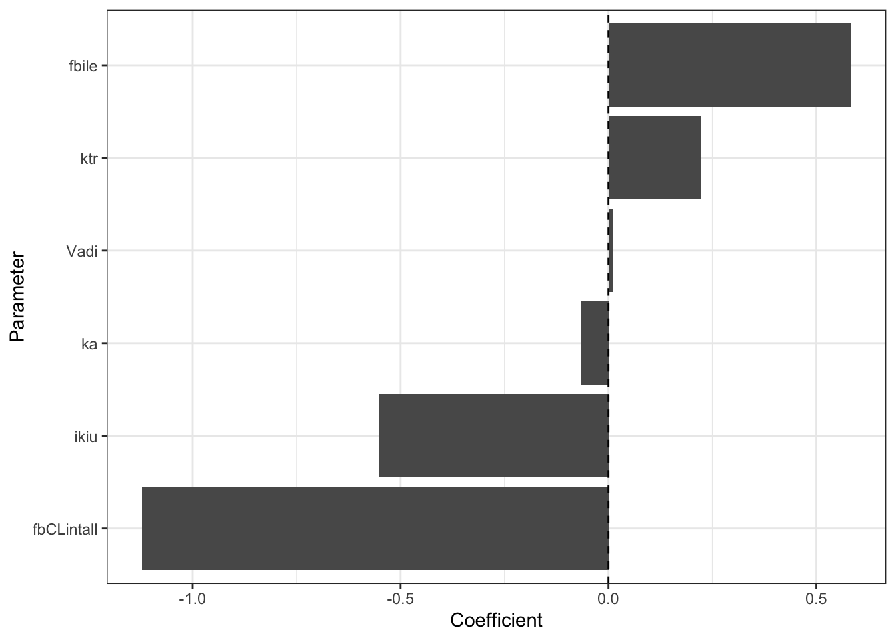

Introduction to parameter optimization
================
Metrum Research Group

  - [Sensitivity analysis with PBPK
    model](#sensitivity-analysis-with-pbpk-model)
      - [Load the model](#load-the-model)
      - [Load a data set](#load-a-data-set)
      - [Define a function for sensitivity
        analysis](#define-a-function-for-sensitivity-analysis)
      - [Pick parameters for sensitivity
        analysis](#pick-parameters-for-sensitivity-analysis)
      - [Summarize](#summarize)

``` r
library(tidyverse)
library(mrgsolve)
library(FME)
```

    ## Loading required package: deSolve

    ## Loading required package: rootSolve

    ## 
    ## Attaching package: 'rootSolve'

    ## The following object is masked from 'package:numDeriv':
    ## 
    ##     hessian

    ## Loading required package: coda

``` r
options(mrgsolve.soloc = "build")
```

# Sensitivity analysis with PBPK model

  - For a small change in a model parameter `p`, what is the change in
    model output `y`?
  - **Local** sensitivity analysis
  - Use the `sensFun` function from the FME package

## Load the model

``` r
mod <- mread_cache("model/yoshikado.cpp")
mod <- update(mod, end = 12, delta = 0.5, atol=1E-12,rtol=1E-12)
```

## Load a data set

``` r
data <- read_csv("data/fig4a.csv") 
data <- mutate(data, DV = ifelse(DV < 0, NA_real_, DV))
data <- filter(data, ID==2)
dose <- filter(data, evid==1)
```

Statin / cyclosporine
DDI

``` r
mod %>% mrgsim_d(dose,delta=0.1) %>% plot(CP~time)
```


## Define a function for sensitivity analysis

Do what we just did, but wrap it up in a function and pass in some
parameters.

``` r
fun <- function(pars,data) {
  mod %>% 
    param(pars) %>%
    mrgsim_d(dose,obsonly=TRUE,output="df") %>%
    select(-ID)
}
```

Just like in the optimization function, we update the model object with
whatever parameters were passed in and simulate.

IMPORTANT to return a data frame of simulated data

## Pick parameters for sensitivity analysis

These are the parameters that we were focusing on in the regression
model. Adding `Vadi` here as a negative
control.

``` r
pars <- as.numeric(param(mod))[c("fbCLintall", "ikiu", "fbile", "ka", "ktr", "Vadi")]

pars
```

    . fbCLintall       ikiu      fbile         ka        ktr       Vadi 
    .  0.7371429  0.0118000  0.3300000  1.0600000  0.6790000  0.1430000

Call `sensFun` from the FME package

  - `func` - the sensitivity function we defined above
  - `parms` - parameters to investigate
  - `sensvar` - the output(s) that you want to look at
  - `tiny` the step size for sensitivity analysis
  - `data` this is an argument for our sensivitity function

<!-- end list -->

``` r
locSens <- FME::sensFun(
  func=fun, 
  parms=pars, 
  sensvar="CP", 
  tiny=1e-5, 
  data=data
)
```

## Summarize

``` r
summary(locSens)
```

    .            value scale    L1     L2   Mean    Min   Max  N
    . fbCLintall 0.737 0.737 1.102 0.2437 -1.102 -1.773 0.000 25
    . ikiu       0.012 0.012 0.539 0.1219 -0.539 -1.032 0.000 25
    . fbile      0.330 0.330 0.587 0.1581  0.587  0.000 1.397 25
    . ka         1.060 1.060 0.204 0.0555 -0.085 -0.495 0.720 25
    . ktr        0.679 0.679 0.281 0.0803  0.206 -0.372 0.845 25
    . Vadi       0.143 0.143 0.022 0.0057  0.011 -0.054 0.059 25

**Summary
plots**

``` r
plot(locSens, legpos="topright", lwd=2)
```


``` r
plot(summary(locSens))
```


A nicer view

``` r
summ <- 
  as_tibble(summary(locSens)) %>%
  mutate(parms = names(pars)) 

ggplot(data=summ, aes(x=reorder(parms, Mean), y=Mean)) + 
  geom_col() + 
  labs(x="Parameter", y="Coefficient") +
  coord_flip() +
  geom_hline(yintercept = 0, lty=2) 
```



``` r
#nicer view
df_temp <- as_tibble(locSens) %>%
  gather(Parameter, Coefficient, -x, -var) %>%
  mutate(Parameter = factor(Parameter)) %>%
  rename(time=x) %>%
  group_by(Parameter) %>%
  mutate(Coefficient = Coefficient - first(Coefficient)) %>%
  ungroup()

ggplot(data=df_temp, aes(x=time, y=Coefficient, col=Parameter)) +
  geom_line(lwd=1) +
  theme(legend.position="right") +
  facet_wrap(~var)
```


``` r
fun2 <- function(pars,data) {
  mod <- param(mod, pars)
  out <- mrgsim_d(mod,data,output="df")
  wres <- (out[["CP"]] - data[["DV"]]) * 1/data[["DV"]]
  ofv <- sum(wres, na.rm=TRUE)
  tibble(time=12,ofv  = ofv)
}


locSens <- sensFun(func=fun2, parms=pars, tiny=1e-5,data=data)

summ <- 
  as_tibble(summary(locSens)) %>%
  mutate(parms = names(pars)) 

ggplot(data=summ, aes(x=reorder(parms, Mean), y=Mean)) + 
  geom_col() + 
  labs(x="Parameter", y="Coefficient") +
  coord_flip() +
  geom_hline(yintercept = 0, lty=2) 
```


